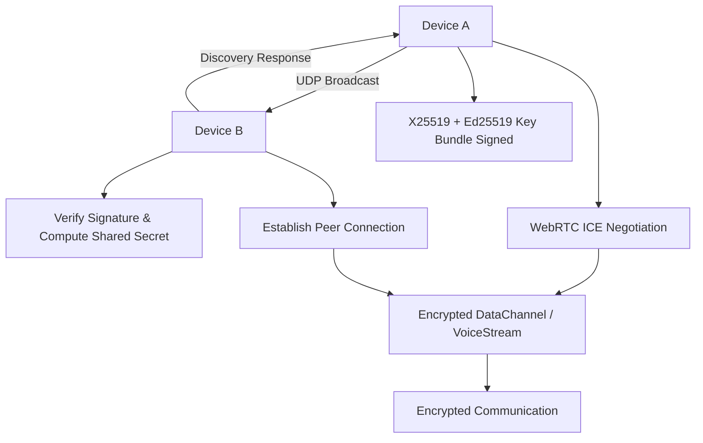

# AirCipher 🌐

### ⚡ Secure. Offline. Peer-to-Peer.

**AirCipher** is a next-generation privacy-focused communication app built for environments without internet connectivity. It enables **real-time voice calling and secure messaging** directly over local networks using WebRTC and cryptographic protocols. By eliminating the need for central servers, AirCipher offers a truly **offline-first** experience while maintaining strong security and low-latency performance.

The core innovation lies in combining peer discovery, identity authentication, and encryption into a seamless local-first stack—ideal for educational campuses, secure internal networks, or remote areas.

---

## ✨ Features

- 🔗 **Offline peer discovery** via UDP broadcast
- 📞 **Real-time voice calling & messaging** over local Wi-Fi (no internet required)
- 🔐 **End-to-end encryption** (X25519 + Ed25519 + AES-256-GCM)
- ❄️ **Pure ICE negotiation** (no STUN/TURN servers)
- ❌ **Zero reliance on external servers** or cloud infrastructure
- 📡 **Lightweight, low-latency local communication**
---

## 🛠 Tech Stack

| Category      | Tools / Protocols                              |
| ------------- | ---------------------------------------------- |
| Language      | Dart (Flutter)                                 |
| Networking    | WebRTC, UDP (RawDatagramSocket), ICE           |
| Encryption    | X25519 (Key Exchange), Ed25519 (Auth), AES-GCM |
| Serialization | JSON                                           |
| Platforms     | Android               |

---

## 🔐 Security Architecture

AirCipher implements a custom **end-to-end encryption** protocol:

- ↻ **X25519** for Elliptic Curve Diffie-Hellman (ECDH) key exchange
- ✅ **Ed25519** for peer identity verification via digital signatures
- 🛡 **AES-256-GCM** for authenticated encryption of all media and messages

Each session is uniquely encrypted and authenticated. **No data is stored or transmitted outside the device or network.**

---

## 🧹 How It Works

### 🔍 1. Peer Discovery

Peers broadcast availability and identity over local Wi-Fi using **UDP broadcast**.

### 🔑 2. Key Exchange & Authentication

Peers exchange **X25519 public keys**, signed with **Ed25519** identities for authenticity.

### ❄️ 3. Connection Establishment

A direct **WebRTC peer-to-peer connection** is negotiated using **ICE** without external signaling (STUN/TURN).

### 💬 4. Messaging and Calls

All communication—both text and media—is **securely encrypted and transmitted** over the direct channel using **data channels** and **SDP audio tracks**.

---

## 🧭 Workflow Diagram



---

## 🚀 Getting Started

### Prerequisites

- Flutter SDK (v3.10 or later)
- Android Studio or VS Code
- Devices on the same local network

### Run the App

```bash
flutter pub get
flutter run
```

---

## 📂 Project Structure

```
lib/
├── core/              # Core models, enums, utils
├── network/           # Discovery, signaling, and WebRTC logic
├── features/          # App screens and widgets
└── main.dart          # Entry point
```

---


